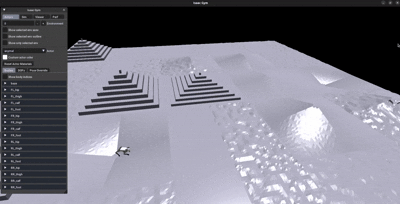
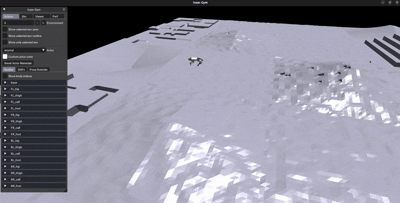
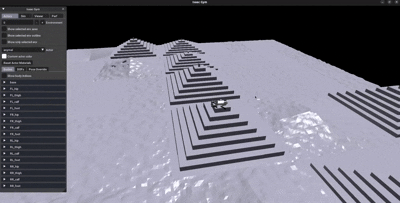

# Quadruped Fall Recovery with Reinforcement Learning

This repository contains training and evaluation code for a **quadruped fall-recovery policy** using reinforcement learning in **NVIDIA Isaac Gym**.

The recovery policy is trained separately and can later be evaluated together with a locomotion policy so that the robot can:

```text
locomotion -> fall detection -> fall recovery -> locomotion
```

The current setup is configured for the **Unitree Go1**, but can be easily extended to **Unitree AlienGo**.

Below are representative evaluation results demonstrating locomotion, fall detection, and recovery across different terrain conditions:

<table>
  <tr>
    <td>
      
    </td>
    <td>
      
    </td>
    <td>
      
    </td>
  </tr>
</table>

## Repository Structure

The main files used for fall-recovery training and evaluation are:

```text
scripts/
├── train_fall_recovery.py      # Train / fine-tune the recovery policy
└── test_loco_recovery.py       # Evaluate locomotion + recovery switching

aliengo_gym/
├── envs/base/
│   ├── fall_recovery_config_tr.py     # Recovery environment configuration
│   ├── go1_loco_config.py             # Locomotion configuration
│   ├── legged_robot.py                # Recovery training environment
|   ├── legged_robot_config.py         # Environment base config
│   └── legged_robot_loco_recovery.py  # Integrated locomotion/recovery environment
│
└── envs/aliengo/
    └── velocity_tracking*/             # Environment wrappers

aliengo_gym_learn/
└── ppo_cse/
    ├── actor_critic.py
    ├── ppo.py
    ├── rollout_storage.py
    └── __init__.py
```

Paths may differ slightly depending on your local repository layout.

## Requirements

The project requires:

- Python 3.8.20
- NVIDIA Isaac Gym
- PyTorch
- `ml_logger`
- `params_proto`

For the recommended PyTorch and Isaac Gym setup, follow the
[Walk These Ways installation instructions](https://github.com/Improbable-AI/walk-these-ways/tree/master#installation-).


Install Isaac Gym separately and verify that it can be imported before running the repository:

```bash
python -c "import isaacgym; print('Isaac Gym available')"
```

Also verify CUDA/PyTorch:

```bash
python -c "import torch; print(torch.cuda.is_available())"
```

## Setup

Clone the repository:

```bash
git clone <repository-url>
cd quadruped-fall-recovery-rl
```

Activate the Python environment in which Isaac Gym and the project dependencies are installed.

From the repository root, install the project in editable mode:


```bash
pip install -e .
```

This makes the repository packages importable while allowing local source-code changes to take effect without reinstalling the package.

## Train the Fall-Recovery Policy

The recovery training entry point is:

```bash
python scripts/train_fall_recovery.py
```

### Training Outputs

Runs are stored under a directory similar to:

```text
runs/gait-conditioned-agility/<date>/train_fall_recovery/<run-id>/
```

Important outputs include:

```text
checkpoints/
├── ac_weights_XXXXXX.pt
├── ac_weights_last.pt
├── body_latest.jit
└── adaptation_module_latest.jit
```

The `.pt` files are used for training/resume, while the `.jit` files are convenient for evaluation/deployment.

## Resume / Fine-Tune a Recovery Policy

Checkpoint loading is configured in the PPO runner.

Set:

```python
RunnerArgs.resume = True
RunnerArgs.resume_path = "/path/to/previous/run"
RunnerArgs.checkpoint = 24800
RunnerArgs.resume_iteration = 24801
```

To start a new run from scratch, use:

```python
RunnerArgs.resume = False
RunnerArgs.resume_path = None
RunnerArgs.resume_iteration = 0
```

## Evaluate Locomotion + Fall Recovery

The integrated evaluation script loads a separately trained locomotion policy and recovery policy:

```bash
python scripts/test_loco_recovery.py \
    --loco-run-dir /path/to/locomotion/run \
    --recovery-run-dir /path/to/recovery/run
```

Both run directories must contain:

```text
checkpoints/body_latest.jit
checkpoints/adaptation_module_latest.jit
```

Example:

```bash
python scripts/test_loco_recovery.py \
    --loco-run-dir runs/gait-conditioned-agility/2026-02-10/train/194644.419603 \
    --recovery-run-dir runs/gait-conditioned-agility/2026-08-24/train_fall_recovery/105731.979852 \
    --x-vel 0.8 \
    --gait trotting 
```

## Force a Fall During Evaluation

A deterministic disturbance can be injected at a selected control step:

```bash
python scripts/test_loco_recovery.py \
    --force-fall-step 250
```

Set:

```bash
--force-fall-step -1
```

to disable forced disturbances.

If the robot is already in recovery mode when the requested disturbance step is reached, the evaluator can skip the additional disturbance.

## Useful Evaluation Arguments

```text
--device cuda:0
--num-envs 1
--num-steps 500
--x-vel 0.8
--y-vel 0.0
--yaw-vel 0.0
--gait trotting
--force-fall-step 250
--headless
```

Available gait names in the current evaluator are:

```text
pronking
trotting
bounding
pacing
```

## Run Headless

For training, headless execution is enabled by default in `train_fall_recovery.py`.

For evaluation:

```bash
python scripts/test_loco_recovery.py --headless
```

Without `--headless`, the Isaac Gym viewer is opened.

## Basic Evaluation Output

During integrated evaluation, the script prints information such as:

```text
step=0075 | controller=RECOVERY | recovery_mode=1.00 | fall=0.00 | done=0.00 | vx=-0.667
```

and controller transitions:

```text
[step 59] >>> entered recovery: [0]
[step 340] <<< handoff -> locomotion: [0]
```

These messages are useful for verifying that the locomotion and recovery policies are switching correctly.

## Notes

- Recovery training and locomotion training are performed separately.
- The integrated evaluator maintains separate observation histories for the two policies.
- The locomotion command is explicitly reset during evaluation so that the commanded gait remains fixed.
- For reproducible evaluation, domain randomization can be disabled in `test_loco_recovery.py`.
- Terrain configuration can be changed in `fall_recovery_config_tr.py` or in the evaluation script.
- Before integrated evaluation, make sure no locomotion-only debug line overrides the selected action after `torch.where(...)`.

## References

This repository builds on and is inspired by prior work on reinforcement-learning-based quadrupedal locomotion, adaptation, and fall recovery:

1. **Walk These Ways: Tuning Robot Control for Generalization with Multiplicity of Behavior**  
   Gabriel B. Margolis and Pulkit Agrawal.  
   *Conference on Robot Learning (CoRL), 2023.*  
   https://arxiv.org/abs/2212.03238

2. **Learning an Adaptive Fall Recovery Controller for Quadrupeds on Complex Terrains**  
   Yidan Lu, Yinzhao Dong, Ji Ma, Jiahui Zhang, and Peng Lu.  
   *arXiv preprint, 2024.*  
   https://arxiv.org/abs/2412.16924

3. **FR-Net: Learning Robust Quadrupedal Fall Recovery on Challenging Terrains through Mass-Contact Prediction**  
   Yidan Lu, Yinzhao Dong, Jiahui Zhang, Ji Ma, and Peng Lu.  
   *IEEE Robotics and Automation Letters, 2025.*  
   https://doi.org/10.1109/LRA.2025.3569117

4. **RMA: Rapid Motor Adaptation for Legged Robots**  
   Ashish Kumar, Zipeng Fu, Deepak Pathak, and Jitendra Malik.  
   *Robotics: Science and Systems (RSS), 2021.*  
   https://arxiv.org/abs/2107.04034

## License

Original code in this repository is released under the [MIT License](LICENSE).

Third-party components, including Isaac Gym and legged-gym-derived code, remain subject to their original licenses. See `LICENSES/` for details.
